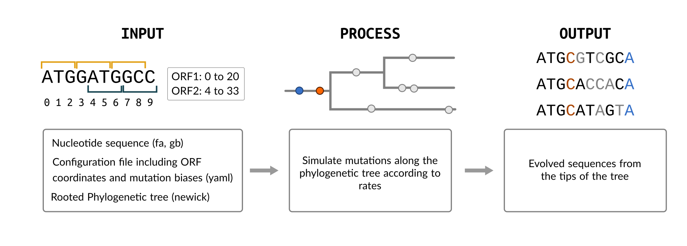
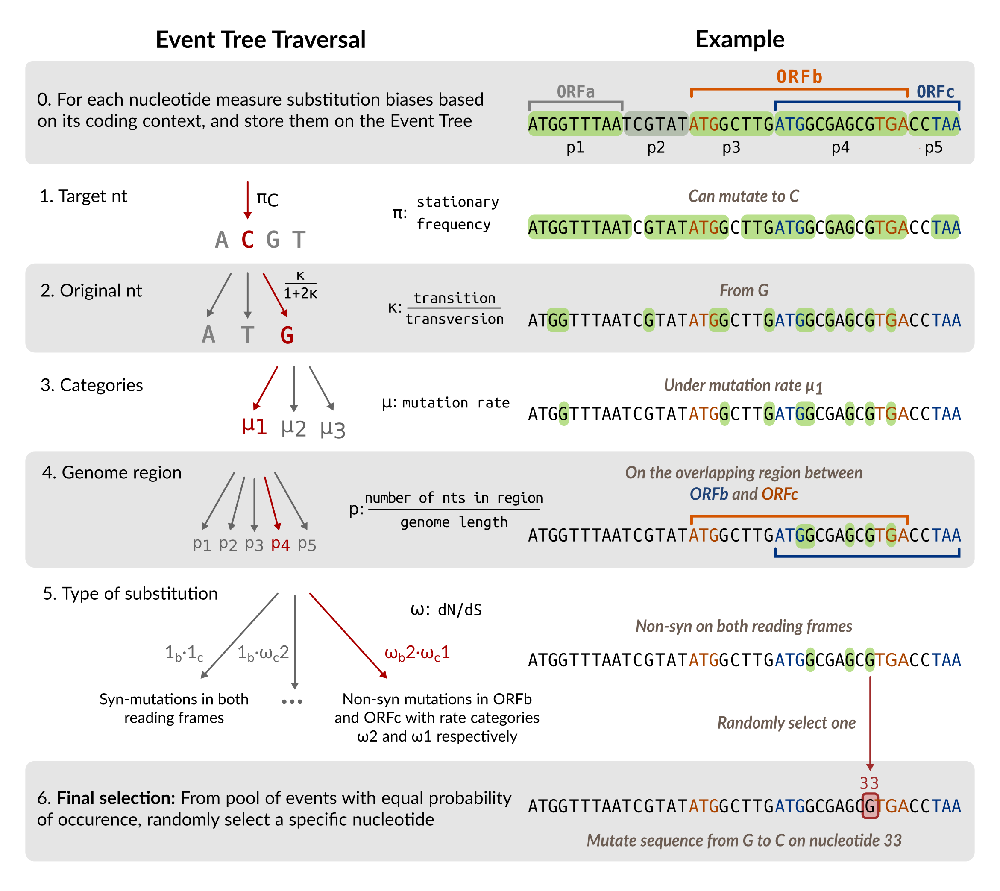

# HexSE: Simulating evolution in overlapping reading frames
HexSE is a Python module designed to simulate sequence evolution along a phylogeny while considering the coding context of the nucleotides. The ultimate porpuse of HexSE is to account for multiple selection preasures on Overlapping Reading Frames. 



+ [System requirements](#system-requirements)  
+ [Installation](#installation)  
+ [Usage](#usage)
+ [Test](#test)  
+ [Output files](#output-files)  
+ [Additional features](#additional-features)
+ [Rationale](#rationale)

## System requirements
`HexSE` is a Python package developed under version 3.6.9.
The following dependencies are required (as listed in the `setup.py` file):

* `scipy`
* `numpy`
* `biopython`
* `pyyaml`

## Installation

To install `HexSE`, there are three options. 

* Clone repository:
```console
$ git clone https://github.com/PoonLab/HexSE
$ cd HexSE
$ sudo python3 setup.py install
```

* Create virtual environment (ideal to ensure the right versions for the dependencies):
```console
$ git clone https://github.com/PoonLab/HexSE
$ cd HexSE 
$ python3 -m venv venv
$ source ./venv/bin/activate
$ python3 setup.py install
```

* Install with `pip` (without clonning):
```console
$ python3 -m pip install --upgrade git+https://github.com/PoonLab/HexSE
```

### Run `hexse` globaly
To run `HexSE` from anywhere in your Linux or macOS system, you can add HexSE's `bin` folder to your `PATH` as following:
```console
$ PATH=<path_to_cloned_repository>/bin:$PATH
```

You should now be able to run your simulations from any directory on your system as:
```console
$ hexse <path_to_sequence_file> <path_to_phylogenetic_tree> <path_to_configuration_file> --outfile <path_to_alignment_file> --logfile <path_to_log_file>
```


## Usage
`HexSE` requires users to provide a nucleotide sequence (either in `fasta` or `genbank` format), a phylogenetic tree (in `newick` format), and a configuration file in [YAML](https://en.wikipedia.org/wiki/YAML) format specifying the substitution biases and the coordinates of the Open Reading Frames (ORFs) in the sequence.

HexSE runs as a Python module from the terminal with command line arguments as following:
```console
$ python3 -m hexse.run_simulation <path_to_sequence_file> <path_to_phylogenetic_tree> <path_to_configuration_file> --outfile <path_to_alignment_file> --logfile <path_to_log_file>
```

**Configuration file**

The configuration file contains the parameters that make the simulation possible. It must include a global substitution rate (`global_rate`), transition-transvertion rate ratio (`kappa`), mutation rates (`mu`), stationary nucleotide frequencies (`pi`), and locations of the coding sequences (`orfs`) with specifications of the distrbution from which dN/dS values (`omega`) are drawn (i.e. `omega_classes`, `omega_shape`, `omega_dist`):

```python
global_rate: 0.05
kappa: 0.3

pi: 
# Note that keys for pi values HAVE to be the letters A, T, G or C
  A: 0.25
  T: 0.25
  G: 0.25
  C: 0.25

orfs:
  # Location of gene C on HBV
  1815,2454:
    omega_classes: 5
    omega_shape: 2.5
    omega_dist: gamma
  
  # From circular genome, this gene is specified as two fragments separated by a colon
  2308, 3182; 0, 1625:  
    omega_classes: 4
    omega_shape: 1.7
    omega_dist: gamma

mu:
  classes: 2
  shape: 1.0
  dist: lognorm

circular: true

```
To create a configuration file from a `.gb` file, users can use `gb_to_yaml.py` available at `./accesory_scripts/`.

**Note:** To declare coding aequences resulting from spliced genes or circular genomes, coordinates must be specified as the same `orf` separated by a colon (`;`), in the exact order than the ribosome would read it. For example, a gene from a circular genome encoded from position `2308` to `1625`, is defined in the configuration file as:

```python
  2308, 3182; 0, 1625:
    omega_classes: 4
    omega_shape: 1.7
    omega_dist: gamma
```

## Tests
Test files are provided in `./tests/fisxtures/`. 

For a `HexSE` test run on [HBV genome](https://www.ncbi.nlm.nih.gov/nuccore/NC_003977.2) along a phylogeny with 100 tips, use:
```console
$ python3 -m hexse.run_simulation tests/fixtures/NC_003977.2_HBV.gb tests/fixtures/100_tree.newick tests/fixtures/conf_complete_HBV.yaml --logfile test_HBV.hexse.log --outfile HBV_align.hexse.fasta
```

## Output Files
`HexSE` creates two files:

* **Fasta file:** sequence alignment in `fasta` format with as many mutated sequences as tips on the phylogeny. 
* **Log file:** with relevant information about the run. Includes location of input and output files, parameters for the run, and open reading frames (ORFs) in the sequence. Aditionally, it includes the regions in which the genome was divided based on their coding context, which are represented by tuples of `0`s and `1`s. Overlapping regions can be recognise if more than one `1` is present in the tuple.

**Log file example:**
```python
INFO:root:
Simulation started at: 2022-10-05 13:24:53.786127

INFO:root:

FILES
	Sequence: tests/fixtures/NC_003977.2_HBV.gb
	Configuration: tests/fixtures/conf_complete_HBV.yaml
	Phylo Tree: tests/fixtures/100_tree.newick
	Alignment: HBV_align.hexse.fasta

PARAMETERS 
	Pi: {'A': 0.25, 'C': 0.25, 'G': 0.25, 'T': 0.25}
	Global rate: 0.05
	Kappa: 0.3
	Rate classes info: 
{ 'classes': 2,
  'dist': 'lognorm',
  'shape': 1.0,
  'values': {'mu1': 0.2615782918648644, 'mu2': 1.3871429788350027}}

INFO:root:

VALID ORFs
[ [[1375, 1840]],
  [[2308, 3182], [0, 1625]],
  [[2849, 3182], [0, 837]],
  [[1815, 2454]]]

Total ORFs: 4

ORFs INFO 
{ '+0': [ { 'coords': [[1375, 1840]],
            'omega_classes': 5,
            'omega_shape': 1.5,
            'omega_values': [ 0.11355787594057443,
                              0.28563496606388417,
                              0.47595127509121704,
                              0.74137416016263,
                              1.383481722705885],
            'orf_map': array([1, 0, 0, 0])},
          { 'coords': [[2308, 3182], [0, 1625]],
            'omega_classes': 2,
            'omega_shape': 2,
            'omega_values': [0.37931535691266643, 1.2206846430881086],
            'orf_map': array([0, 0, 1, 0])}],
  '+1': [ { 'coords': [[2849, 3182], [0, 837]],
            'omega_classes': 3,
            'omega_shape': 1.2,
            'omega_values': [ 0.11098924219663184,
                              0.36293140817456776,
                              0.9660793495713997],
            'orf_map': array([0, 0, 0, 1])}],
  '+2': [ { 'coords': [[1815, 2454]],
            'omega_classes': 4,
            'omega_shape': 1.0,
            'omega_values': [ 0.05478151305786287,
                              0.190700742494181,
                              0.3999999999999998,
                              0.9545177444479566],
            'orf_map': array([0, 1, 0, 0])}],
  '-0': [],
  '-1': [],
  '-2': []}

INFO:root:

REGIONS
{ (0, 0, 1, 0): {'coords': [[837, 1374], [2454, 2848]], 'len': 933},
  (0, 0, 1, 1): {'coords': [[0, 836], [2849, 3181]], 'len': 1170}, # Overlapping region on a circular genome
  (0, 1, 0, 0): {'coords': [[1840, 2307]], 'len': 468},  # Non-overlapping region
  (0, 1, 1, 0): {'coords': [[2308, 2453]], 'len': 146},
  (1, 0, 0, 0): {'coords': [[1625, 1814]], 'len': 190},
  (1, 0, 1, 0): {'coords': [[1375, 1624]], 'len': 250},  # Overlapping region
  (1, 1, 0, 0): {'coords': [[1815, 1839]], 'len': 25}}

INFO:root:
	Simulation Ended at: 2022-10-05 13:25:47.001636
	Simulation lasted: 0:00:53.215509 seconds
```

## Aditional Features
`HexSE` includes a set of scripts located at `./accesory_scripts/` that might be usefult to prepare information for a run and to process the alignment afterwards. 

* `gb_to_yaml.py`: Creates a YAML configuration file by identifying the Coding Sequences (CDSs) on a `genbank` file and sets default values to `mu`, `kappa`, `global_rate`, and `pi`.

* `get_orfs.py`: Obtains the Open Reading Frames (ORF) of a genome based on its `genbank` annotations.

* `extract_cds`: From a sequence alignment in `fasta` file, extracts a specific region between two nucleotide locations.    

## Rationale

Gene overlap occurs when two or more genes are encoded by the same nucleotides.
This phenomenon is found in all taxonomic domains, but is particularly common in viruses, where it may provide a mechanism to increase the information content of compact genomes. The presence of overlapping reading frames (OvRFs) can skew estimates of selection based on the rates of non-synonymous and synonymous substitutions, since a substitution that is synonymous in one reading frame may be non-synonymous in another, and vice versa. 

To understand the impact of OvRFs on molecular evolution, HexSE implemented a versatile simulation model of nucleotide sequence evolution along a phylogeny with an arbitrary distribution of reading frames in linear or circular genomes. We use a custom data structure to track the substitution rates at every nucleotide site, which is determined by the stationary nucleotide frequencies, transition bias, and the distribution of selection biases (dN/dS) in the respective reading frames.


